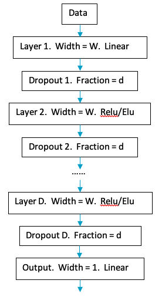
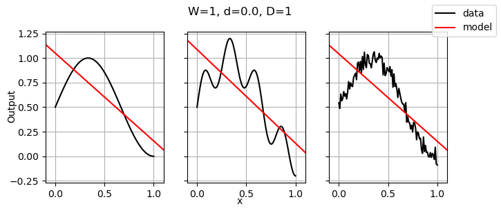
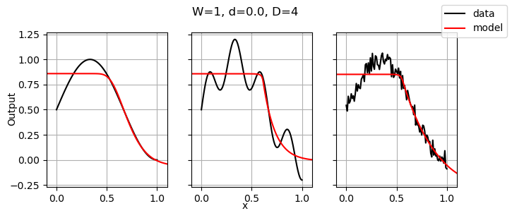
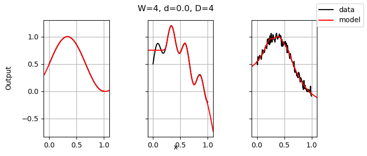
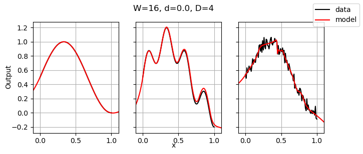
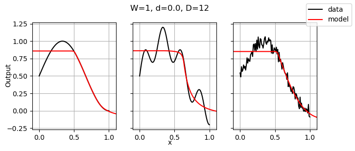
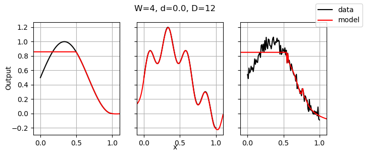
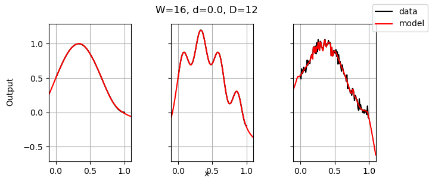
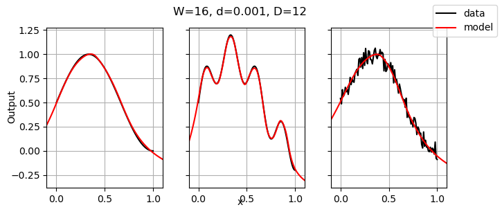

# Examples of using neural networks to fit data

This repository provides examples of fitting data using neural networks.  Simple, synthetic data is created, and then modelled using neural networks of differing complexity in order to illustrate how the architecture of the neural network impacts the fit.

## Software requirements

To run the examples in this repository, python3 is needed, along with the following libraries:

- numpy
- pandas
- matplotlib
- keras

## The synthetic data

Three sets of synthetic data - "smooth", "oscillating" and "noisy" - are generated using the python script [generate_data.py](generate_data.py).  In the synthetic data, there is just one input, called `x`, and one output, which is either "smooth", "oscillating" or "noisy".

```
ep = 0.01
noise = 0.2
x = np.arange(0, 1 + ep, ep)
smooth = 0.5 + 0.5 * np.sin(1.5 * np.pi * x)
oscillating = smooth + noise * np.sin(7.5 * np.pi * x)
noisy = smooth + noise * (np.random.rand(len(x)) - 0.5)
```

The synthetic data is shown visually in the figure below


The "noisy" output is generated using `np.random`, which means if you regenerate the data, it will differ from that in the repository.  This will cause your results to be slightly different than quoted on this page.  However, even if you use [data.csv](data.csv) then your results will likely be slightly different, because the machine learning uses stochastic gradient descent, meaning that it also incorporates randomness.

Note that the input and the outputs are already scaled to lie approximately between 0 and 1, so no scaling is needed.  In real-world datasets, scaling the inputs and outputs to lies between 0 and 1 is important, as it helps the algorithm converge.

Most real-world datasets will have multiple inputs instead of just 1, but the general features of neural networks described here are likely to hold true.

## Validation

An important aspect, possibly the most important aspect, of machine learning, is validation of the trained model against data.  Validation allows the data analyst to quantify the goodness of the trained model.  The most common practice is to "hold back" a subset of the data.  The held-back data is called the validation set, and it is not used to train the model.  After model selection (e.g., choosing the best neural network architecture) the final trained model is evaluated on the validation set.

Carefully defining the validation set is very important.  For instance, if extrapolation away from the boundary of existing inputs is important (eg, if extrapolation to $x > 1$ is important in the case studied here) then the validation set would likely contain all the points close to the boundary (for instance, all points with $x > 0.9$).  Then, all candidate models would be trained on $x \leq 0.9$, the best model selected using some criteria, and it would be finally evaluated on the validation set (with $x > 0.9$) to understand the extrapolatory power of the model.  It is vital to carefully consider the purpose of the machine learning, and define the validation set appropriately.

In this example, no validation set is used, because the purpose of this repository is simply to illustrate the impact of the neural network architecture on the data fit.

## Architectures

The architectures considered here are shown in the figure below.  The neural networks have the following properties:

- The first layer has width $W$ (a parameter set by the user) and a linear activation function.
- The last layer has width 1 (because of the one output: either smooth, oscillating or noisy) and a linear activation function.  The first and last layers are linear layers so that without any of the other layers, they can mimic a linear regression (that is, they will fit a straight line).  With just the first and last layers, the number of trainable parameters in the neural network is $W(1 + 1) + (W + 1)$, where the $W(1 + 1)$ are the coefficients and intercepts of the first layer, and the $W$ represents the coefficients of the last layer, and the $1$ is the intercept of the last layer.  This is greater than the 2 parameters (1 linear regression) needed, so many of these parameters are redundant.
- In between these, there are $D - 1$ layers with "elu" activation functions.  (Other activation functions, such as "relu" could be used, but they lead to similar results in this case.)
- In addition, if the dropout parameter $d$ is positive, there are also $D$ dropout layers to address over-fitting.



These types of models are easily built using `keras`, with code along the lines of:

```
model = Sequential()
model.add(Dense(W, kernel_initializer = 'normal', activation = 'linear', input_shape = (1,)))
model.add(Dropout(d))
model.add(Dense(W, kernel_initializer = 'normal', activation = 'elu'))
model.add(Dropout(d))
model.add(Dense(1, kernel_initializer = 'normal', activation = 'linear'))
model.compile(loss = 'mean_squared_error', optimizer = 'adam')
```

The code [fit.py](fit.py) performs the training and plotting of the results.

## Results for $d=0$

The results displayed below demonstrate that:

- when $D = 1$, the neural network mimics a linear regression, by design;
- when increasing $W$ or $D$, more nonlinearities can be accommodated;
- mostly, the gradient descent algorithm, converges to a reasonable result, but sometimes it appears to fail;
- extrapolation to $x < 0$ or $x > 1$ is generally unpredictable.

















## Results for $d>0$

Notice the $(W, D) = (16, 12)$ result conforms to the noisy data.  If this is undesired, a small dropout, such as $d = 0.001$ can be used:




