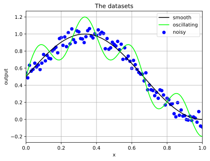

# Examples of using neural networks to fit data

This repository provides examples of fitting data using neural networks.  Simple, synthetic data is created, and then modelled using neural networks of differing complexity in order to illustrate how the architecture of the neural network impacts the fit.

## Software requirements

To run the examples in this repository, python3 is needed, along with the following libraries:

- numpy
- pandas
- matplotlib

## The synthetic data

Two sets of synthetic data - "smooth" and "noisy" - are generated using the python script [generate_data.py](generate_data.py).  In the synthetic data, there is just one input, called `x`, and one output, which is either "smooth" or "noisy".

```
ep = 0.01
noise = 0.2
x = np.arange(0, 1 + ep, ep)
smooth = 0.5 + 0.5 * np.sin(1.5 * np.pi * x)
noisy = smooth + noise * (np.random.rand(len(x)) - 0.5)
```

The synthetic data is shown visually in the figure below



The "noisy" output is generated using `np.random`, which means if you regenerate the data, it will differ from that in the repository.  This will cause your results to be slightly different than quoted on this page.  However, even if you use [data.csv](data.csv) then your results will be slightly different, because the machine learning uses stochastic gradient descent, meaning that it also incorporates randomness.

Note that the input and the outputs are already scaled to lie approximately between 0 and 1, so no scaling is needed.  In real-world datasets, scaling the inputs and outputs to lies between 0 and 1 is important, as it helps the algorithm converge.

Most real-world datasets will have multiple inputs instead of just 1, but the general features of neural networks are likely to hold true.

## More


